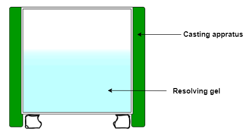
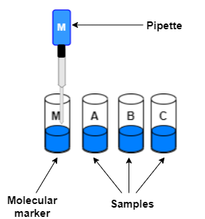
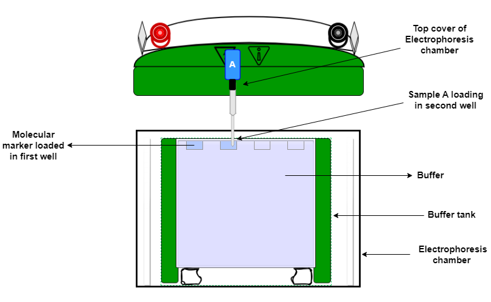
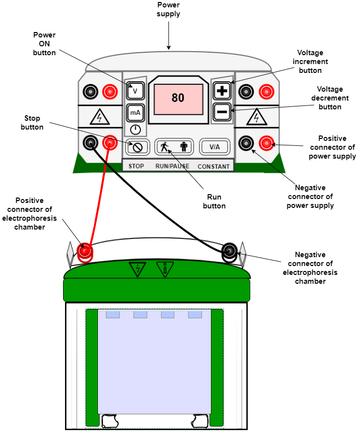
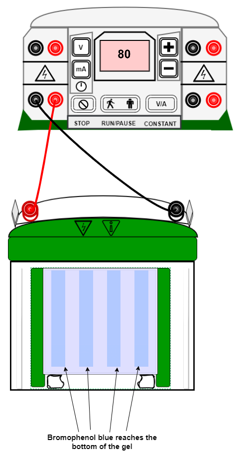
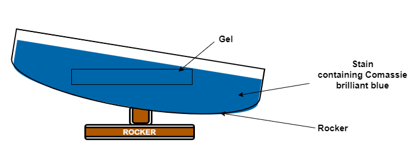
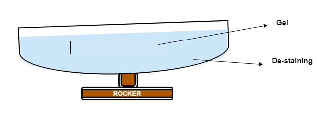
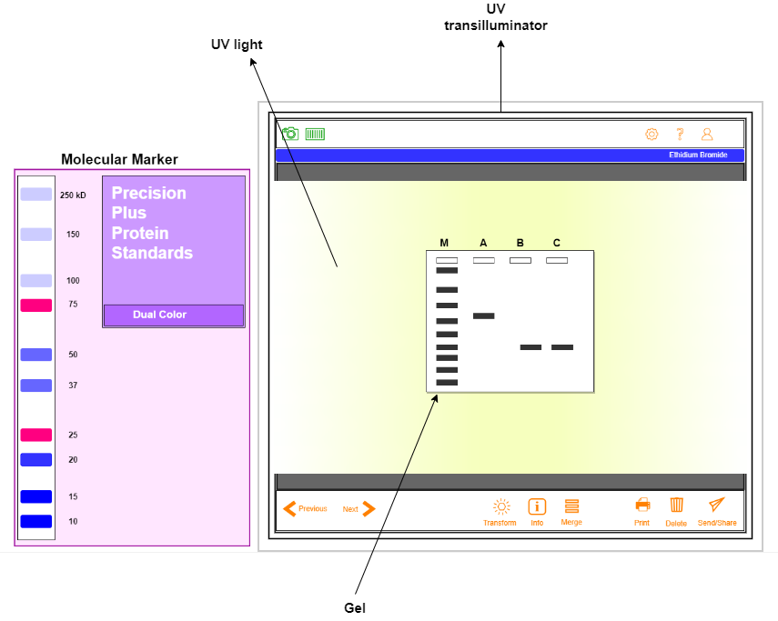

## Procedure

To perform an SDS-PAGE experiment, the following steps must be followed.

1. **Casting of the SDS-PAGE resolving gel**

    1. Place sandwich of glass plates and spacers on gel-casting stand. 
    2. For one 12% resolving gel, add to a 15 ml tube: 2 ml 30% acrylamide (19:1), 50 μl 10% SDS, 1.3 ml 1.5 M Tris-HCl (pH 8.8), 1.6 ml water 
    3. Add 50 μl 10% APS, 3.5 μl TEMED, mix well 
    4. Pipette the resolving gel solution into the gel-casting sandwich up to the line marked on the plate 
    5. Overlay the gel solution with a layer of 99% isopropanol to prevent oxidation and facilitate polymerization 
    6. Allow the resolving gel to polymerize for 1h 
    7. Rinse top of gel with milliQ water, remove residual water with a kimwipe 

2. **Casting of the SDS-PAGE stacking gel**
    1. For the stacking gel, add to a 15 ml tube: 1.2 ml water, 260 μl 30% acrylamide, 500 μl 0.5 M Tris-HCl (pH 6.8) and 20 μl of 10% SDS
    2. Add 20 μl of 10 % APS and 3.5 μl TEMED, mix well
    3. Pipette on top of the resolving gel, filling to top of the plate
    4. Insert the comb to make wells, avoid bubbles
    5. Allow polymerization for 30 min

3. **Preparation of the protein samples**
    1. Dilute the samples with water and add the 4X tracking dye in the ratio 3:1 to get 40-50μL
    total sample.
    2. The protein samples are heated at 95 degree Centigrade for 15-20min, then centrifuged at 11000rpm for
3min before loading into wells of the polyacrylamide gel.  

4. **Setting up the apparatus for SDS-PAGE**
     The apparatus must be set up as shown in figure 5, and connected to the power supply.
      1. Place the polymerized gel into the gel rig
      2. Add SDS gel running buffer to the upper and lower chambers
      3. Remove the comb and fill with running buffer

Figure1: Set up of an SDS-PAGE experiment.

5. **Electrophoresis**  

    1. Pre-run the gel for better results
    2. Load the molecular weight marker and samples into the wells using a micropipette with gel loading tips
    3. Switch on the power supply. For stacking the samples, 80-100V is preferred. For resolving the samples, 100-120V is used, for 1-1.5hrs.
    4. Run gel until bromophenol blue reaches the bottom of the gel
    5. Turn off power supply and disconnect the leads
    6. Discard the running buffer, rinse the gel sandwich in water and separate the plates to access the gel

6. **Staining and visualization**
   1. After washing with water, add stain (containing Coomassie brilliant blue) to the gel. Keep in rocking
      condition for 2-3 hrs.
   2. Then wash off the stain with water and add destain, keep under rocking condition for 4-6 hrs. 
   3. Visualize under UV transilluminator.

## Simulation Instrument Setup

1. **Casting of the SDS-PAGE resolving gel**

2. **Casting of the SDS-PAGE stacking gel**

3. **Preparation of the protein samples**

4. **Setting up the apparatus for SDS-PAGE**

5. **Electrophoresis**  

 

6. **Staining**  

7. **De-staining**  

8. **Visualization**

